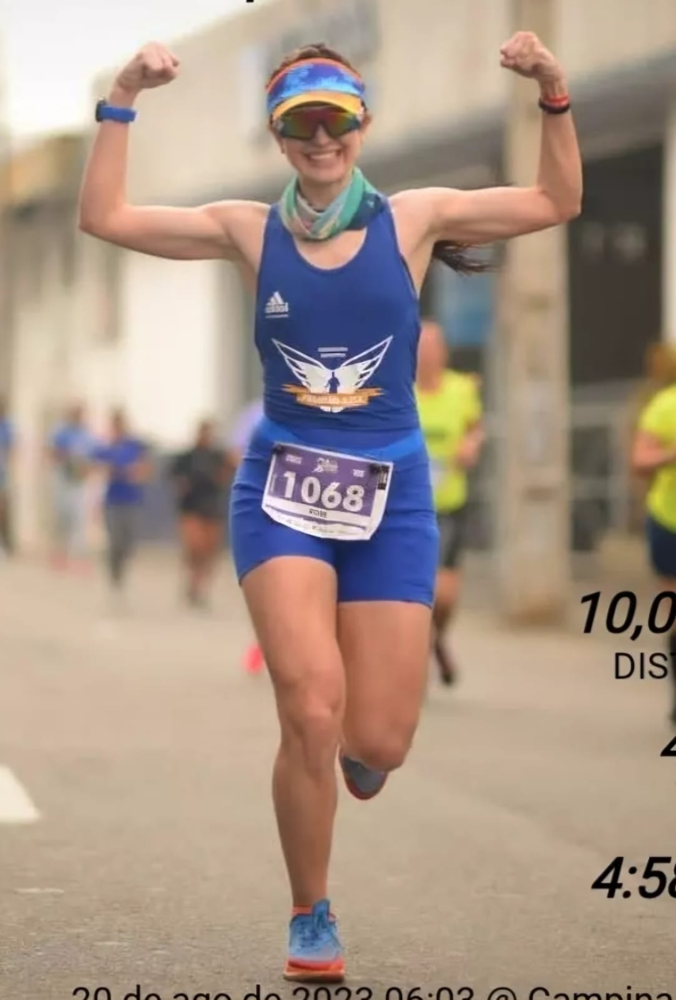

    preview do podcast

    <audio src="output/podcast_editado.MP3" controls title="Podcast editado"></audio>

# Projeto Podcast Gerado por I.A.s

Projeto com o objetivo de gerar um podcast utilizando ferramentas de IA através de prompts mais trabalhados.

Esse trabalho faz parte de uma das atividades desenvolvidas durante o Bootcamp Caixa-IA Generativa com Microsoft Copilot.

Utilizei uma esteira de prompts para gerar cada etapa do processo criativo.

## 💻 Tecnologias utilizadas no projeto

- [ChatGPT](https://chat.openai.com/) 
- [LeonardoAI](https://www.app.leonardo.ai//app/)
- [ElevenLabs](https://beta.elevenlabs.io/)
- [Capcut](https://www.capcut.com/pt-br/)

## ✨ Como foi feito ?

- Roteiro gerado via chatgpt
- Audio gerado pela elevenLabs
- LeonardoAI Para gerar capas
- Capcut para tratar aúdio e adicionar sons de fundo

## 👨‍💻 Expert

    
    
&nbsp&nbsp&nbspRose Angelly 
    &nbsp&nbsp&nbsp
    <a href="https://github.com/roseangelly">
    GitHub</a>&nbsp;|&nbsp;
    <a href="https://www.linkedin.com/in/
rose-angelly-cabral-022059225">LinkedIn</a>
&nbsp;|&nbsp;
    <a href="https://www.instagram.com/rose.angelly/profilecard/?igsh=MXZ5bxOTIxeGIndw==/">
    Instagram</a>
&nbsp;|&nbsp;

  

---

⌨️ com 💜 de alguém em busca da melhor versão e curiosa no mundo da IA [Rose Angelly](https://github.com/roseangelly)
